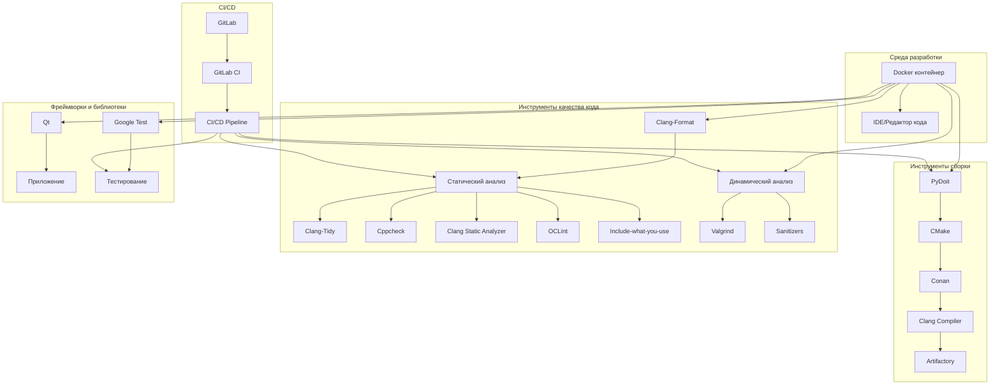
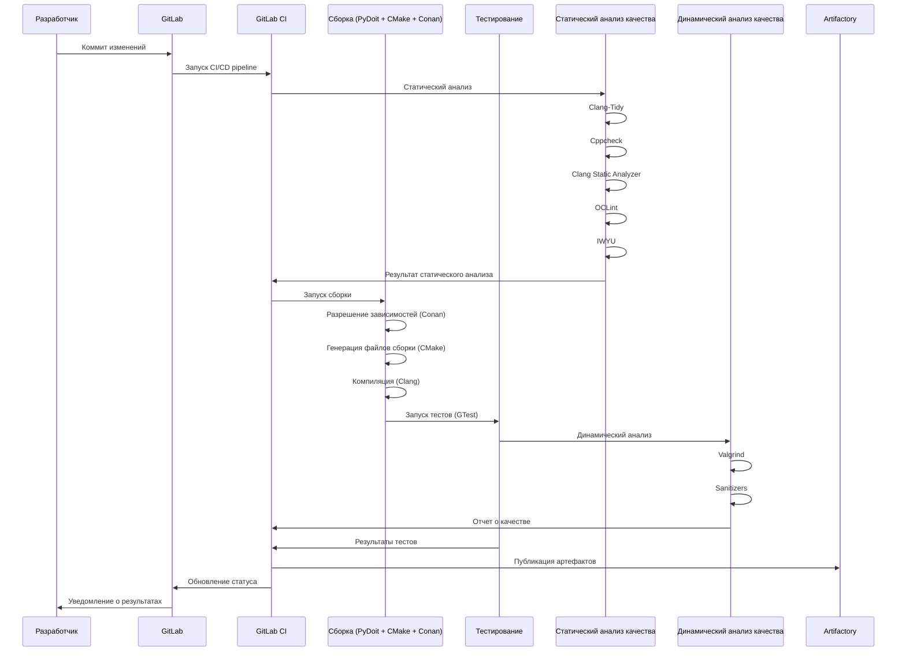
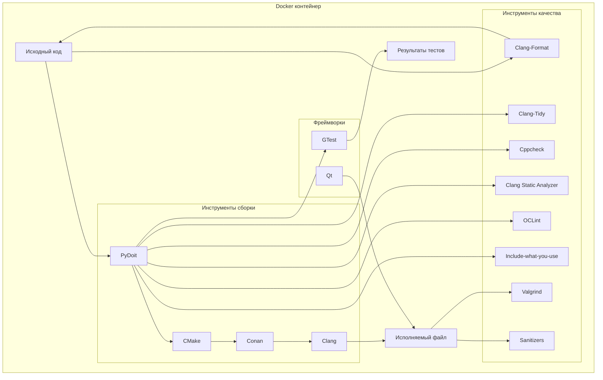
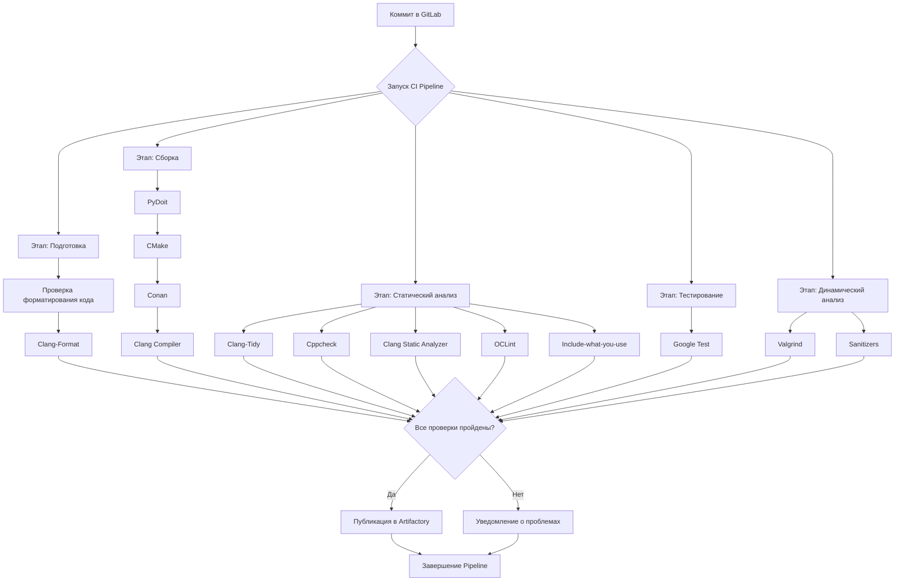
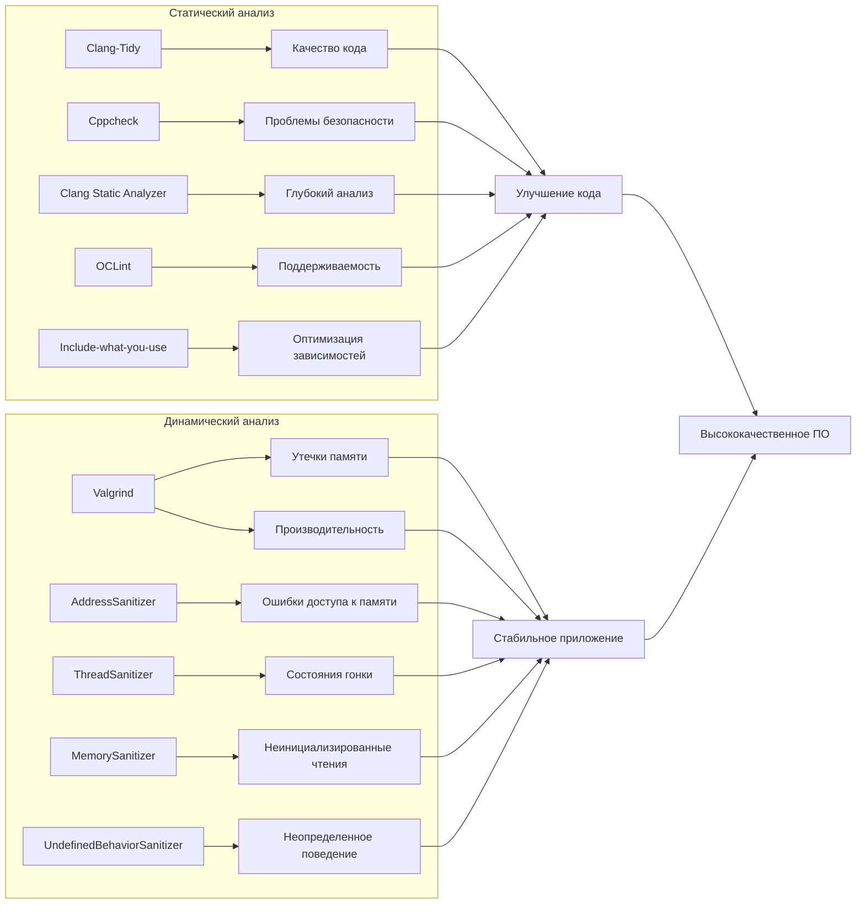
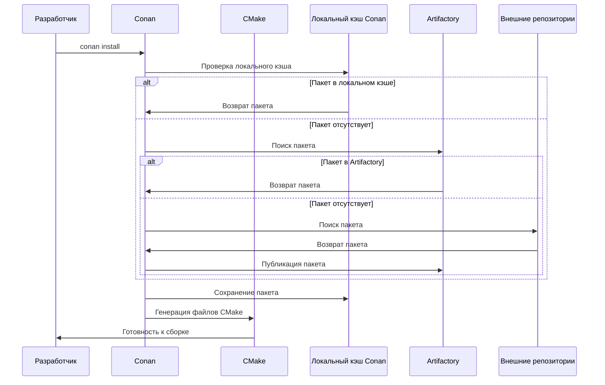

# Обзор стека инструментов C++ проекта

Данный документ содержит обзор инструментов, используемых в C++ проекте с Docker-контейнером для разработки.

## Содержание

1. [Обзор стека](#обзор-стека)
2. [Инструменты сборки и управления зависимостями](#инструменты-сборки-и-управления-зависимостями)
3. [Инструменты форматирования кода](#инструменты-форматирования-кода)
4. [Инструменты статического анализа](#инструменты-статического-анализа)
5. [Инструменты динамического анализа](#инструменты-динамического-анализа)
6. [Фреймворки и библиотеки](#фреймворки-и-библиотеки)
7. [CI/CD](#cicd)
8. [Диаграммы](#диаграммы)

## Обзор стека

Проект использует Docker-контейнер для разработки, который включает в себя все необходимые инструменты. Это обеспечивает единую среду разработки для всех участников проекта и упрощает настройку окружения.

## Инструменты сборки и управления зависимостями

### PyDoit

PyDoit - это инструмент автоматизации задач, написанный на Python. В проекте он используется для управления задачами сборки, тестирования и других операций.

**Основные возможности:**
- Определение задач и их зависимостей в Python
- Выполнение только необходимых задач на основе изменений файлов
- Параллельное выполнение задач

### CMake

CMake - это кросс-платформенный генератор систем сборки. Он используется для настройки процесса сборки проекта.

**Основные возможности:**
- Генерация файлов сборки для различных платформ и компиляторов
- Управление зависимостями проекта
- Настройка параметров компиляции

### Conan

Conan - это менеджер пакетов для C и C++. Он используется для управления зависимостями проекта.

**Основные возможности:**
- Управление бинарными пакетами
- Интеграция с CMake
- Поддержка различных платформ и компиляторов

### Clang Compiler

Clang - это компилятор для языков C, C++, Objective-C и Objective-C++. В проекте используется для компиляции исходного кода.

**Основные возможности:**
- Высокая производительность
- Подробные сообщения об ошибках
- Интеграция с инструментами статического анализа

### Artifactory

Artifactory - это менеджер бинарных репозиториев. Он используется для хранения и управления артефактами проекта.

**Основные возможности:**
- Хранение бинарных артефактов
- Управление версиями
- Интеграция с CI/CD

## Инструменты форматирования кода

### Clang-Format

Clang-Format - это инструмент для автоматического форматирования кода на C/C++. Он обеспечивает единый стиль кода во всем проекте.

**Основные возможности:**
- Автоматическое форматирование кода
- Настраиваемые правила форматирования
- Интеграция с IDE и системами контроля версий

## Инструменты статического анализа

### Clang-Tidy

Clang-Tidy - это инструмент статического анализа для C++. Он используется для обнаружения и исправления типичных ошибок программирования.

**Основные возможности:**
- Проверка соответствия стандартам кодирования
- Обнаружение потенциальных ошибок
- Автоматическое исправление некоторых проблем

### Cppcheck

Cppcheck - это инструмент статического анализа для C/C++. Он фокусируется на обнаружении ошибок, которые компиляторы обычно не находят.

**Основные возможности:**
- Обнаружение утечек памяти
- Проверка на переполнение буфера
- Обнаружение неинициализированных переменных

### Clang Static Analyzer

Clang Static Analyzer - это инструмент статического анализа, который является частью проекта Clang. Он используется для глубокого анализа кода.

**Основные возможности:**
- Анализ потока данных
- Обнаружение сложных ошибок
- Визуализация путей выполнения

### OCLint

OCLint - это инструмент статического анализа для C, C++ и Objective-C. Он фокусируется на улучшении качества и поддерживаемости кода.

**Основные возможности:**
- Обнаружение сложного кода
- Проверка на соответствие стандартам
- Настраиваемые правила

### Include-what-you-use

Include-what-you-use (IWYU) - это инструмент для оптимизации директив #include в C и C++. Он помогает уменьшить время компиляции и зависимости.

**Основные возможности:**
- Анализ зависимостей заголовочных файлов
- Предложения по оптимизации директив #include
- Интеграция с системами сборки

## Инструменты динамического анализа

### Valgrind

Valgrind - это инструмент для обнаружения проблем с памятью и производительностью. Он используется для динамического анализа программ.

**Основные возможности:**
- Обнаружение утечек памяти
- Профилирование кода
- Обнаружение гонок данных

### Sanitizers

Sanitizers - это набор инструментов для динамического анализа, встроенных в компиляторы GCC и Clang. Они используются для обнаружения различных типов ошибок во время выполнения.

**Основные типы:**
- AddressSanitizer (ASan) - для обнаружения ошибок доступа к памяти
- ThreadSanitizer (TSan) - для обнаружения гонок данных
- MemorySanitizer (MSan) - для обнаружения неинициализированных чтений
- UndefinedBehaviorSanitizer (UBSan) - для обнаружения неопределенного поведения

## Фреймворки и библиотеки

### Qt

Qt - это кросс-платформенный фреймворк для разработки программного обеспечения. Он используется для создания графического интерфейса пользователя и других компонентов приложения.

**Основные возможности:**
- Кросс-платформенный GUI
- Богатый набор классов и функций
- Интеграция с инструментами разработки

### Google Test (gtest)

Google Test - это фреймворк для написания модульных тестов на C++. Он используется для тестирования компонентов приложения.

**Основные возможности:**
- Простой синтаксис для написания тестов
- Поддержка параметризованных тестов
- Интеграция с системами сборки и CI/CD

## CI/CD

### GitLab + GitLab CI

GitLab - это веб-платформа для управления репозиториями Git. GitLab CI - это встроенный инструмент непрерывной интеграции и доставки.

**Основные возможности:**
- Автоматическое выполнение задач при изменении кода
- Параллельное выполнение задач
- Интеграция с другими инструментами

## Диаграммы

### Общая архитектура стека инструментов

### Процесс сборки и тестирования

### Взаимодействие компонентов в Docker-контейнере

### Процесс непрерывной интеграции (CI)

### Взаимосвязь инструментов статического и динамического анализа

### Управление зависимостями с Conan и Artifactory

